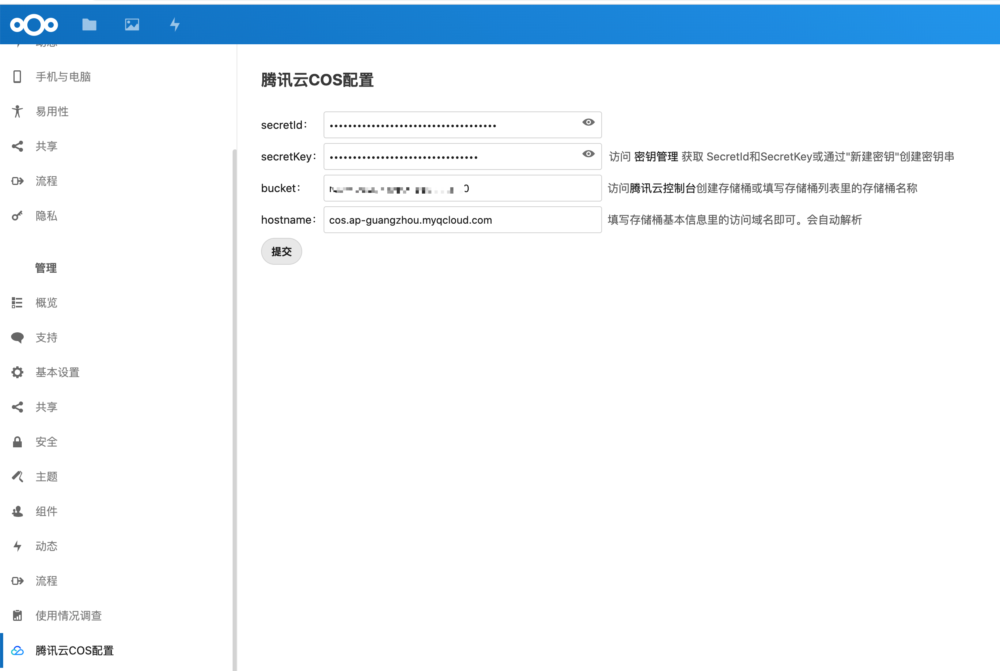
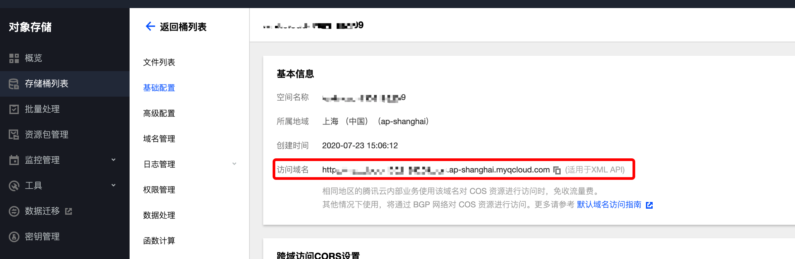

# 腾讯云对象存储配置应用

## 1.介绍
> 配置Nextcloud挂载腾讯云COS存储挂载，使用腾讯云作为Nextcloud的默认存储介质。

| 标题       | 名称                                                         |
| ---------- | ------------------------------------------------------------ |
| 中文名称   | 腾讯云对象存储配置（COS）应用                                |
| 英文名称   | tencentcloudcosconfig                                        |
| 最新版本   | 1.0.0 (2020.08.07)                                           |
| 适用平台   | [Nextcloud](https://nextcloud.com/)                          |
| 适用产品   | [腾讯云对象存储（COS）](https://cloud.tencent.com/product/cos) |
| 文档中心   | [春雨文档中心](https://openapp.qq.com/docs/) |
| 主创团队   | 腾讯云中小企业产品中心（SMB Product Center of Tencent Cloud） |

## 2.功能特性

- 配置Nextcloud让其支持腾讯云对象存储（COS）作为主要存储点

## 3.安装指引

### 3.1.部署方式

### 3.1.部署方式一：通过GitHub部署安装

> 1. git clone https://github.com/Tencent-Cloud-Plugins/tencentcloud-nextcloud-cos.git
> 2. 复制tencentcloud-nextcloud-cos目录中的tencentcloudcosconfig文件夹到Nextcloud安装目录/apps文件夹里面
> 3. 进入nextcloud应用管理后台，启用Tencentcloud COS Config这个应用

## 4.使用指引

### 4.1.界面功能介绍

> 启用应用后，对腾讯云COS进行配置。配置介绍请参考下方的[名词解释](#_4-2-名词解释)

### 4.2.名词解释

- **SecretId**：在腾讯云云平台API密钥上申请的标识身份的 SecretId。详情参考[腾讯云文档](https://cloud.tencent.com/document/product)
- **SecretKey**：在腾讯云云平台API密钥上申请的标识身份的SecretId对应的SecretKey。详情参考[腾讯云文档](https://cloud.tencent.com/document/product)
- **bucket**：COS服务中存储桶的名称。详情参考[腾讯云文档](https://cloud.tencent.com/document/product/436/41153)
- **hostname**：bucket基本信息里的访问域名，可参考下方[图示](#_4-3-名词解释图示)。详情参考[腾讯云文档](https://cloud.tencent.com/document/product/436/6224)

### 4.3.名词解释图示

> 对应[名词解释](#_4-2-名词解释)中的hostname

## 5.获取入口

| 插件入口          | 链接                                                         |
| ----------------- | ------------------------------------------------------------ |
| GitHub            | [link](https://github.com/Tencent-Cloud-Plugins/tencentcloud-nextcloud-cos)    |

## 6.FAQ

> 暂无

## 7.版本迭代记录

- 配置Nextcloud让其支持腾讯云对象存储（COS）作为主要存储点

---
本项目由腾讯云中小企业产品中心建设和维护，了解与该插件使用相关的更多信息，请访问[春雨文档中心](https://openapp.qq.com/docs/) 

请通过[咨询建议](https://support.qq.com/products/164613) 向我们提交宝贵意见。
